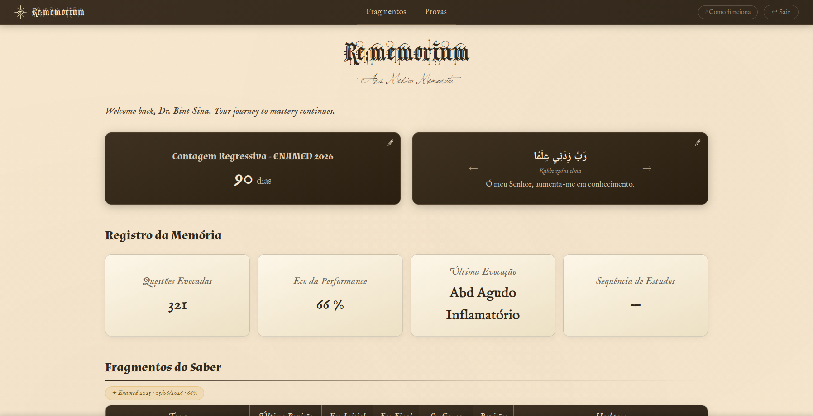
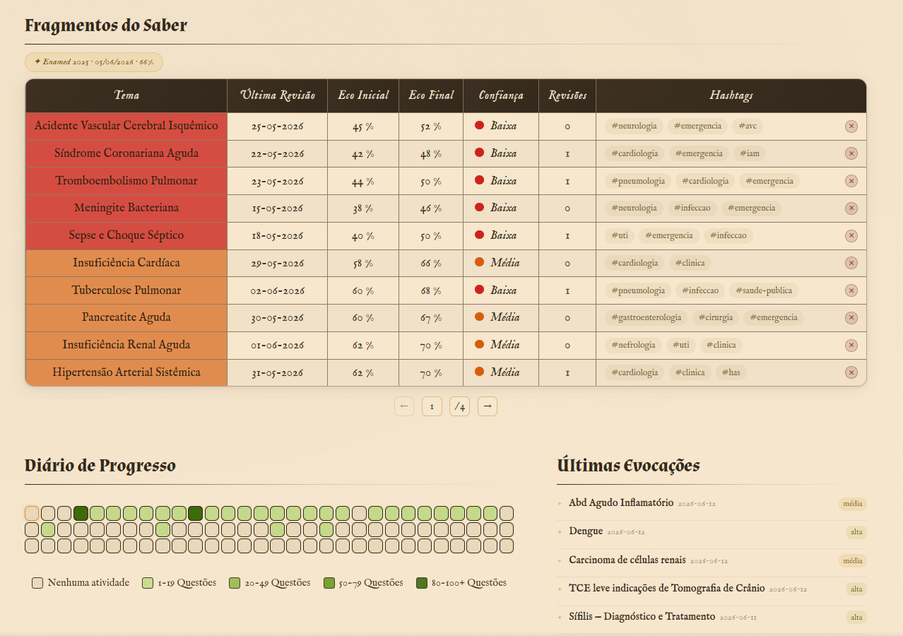

# Rememorium: Ars Medica Memorata

📖 **Overview**  
Rememorium is a spaced repetition study system with a grimoire-inspired aesthetic, designed to enhance exam preparation through active recall and performance tracking.

🌟 **Key Features**
- **Fragment Registration**: Track study topics with confidence levels and hashtag organization  
- **Spaced Repetition Logic**: Intelligent prioritization system (urgent, unstable, consolidated)  
- **Interactive Dashboard**: Comprehensive statistics and exam countdown  
- **Progress Visualization**: Heatmap display of study activity  
- **Study Tools**: Customizable reminders and Pomodoro timer integration  

🚀 **Technology**
- **Frontend**: HTML5, CSS3, JavaScript (ES6 Modules)  
- **Authentication**: Firebase Auth  
- **Date Handling**: Flatpickr  
- **Data Storage**: Firebase Firestore  

📋 **System Overview**
- Register study topics with performance metrics  
- Track initial and final recall performance  
- Categorize by confidence levels (Low, Medium, High)  
- Organize with customizable hashtags  
- Spaced repetition algorithm: Urgent, Unstable, Consolidated  

🎨 **Design Philosophy**  
Inspired by medieval grimoires and academic aesthetics, Rememorium combines functional spaced repetition with an immersive, thematic interface that enhances the study experience.  

🔧 **Technical Implementation**
- Modular JavaScript architecture  
- Responsive design for multiple devices  
- Real-time data synchronization  
- Local storage for offline functionality  

---

📸 **Screenshots**

---

📝 **Nota do Desenvolvedor**  
Projeto pessoal em **desenvolvimento ativo**.  
Originalmente criado para preparação ao *Revalida*, mas adaptável a qualquer área de estudo.  

---

✨ *Rememorium: Where knowledge becomes memory, and memory becomes mastery.*